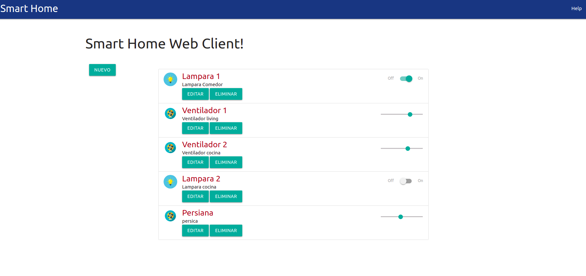

Introducción
============
 
Este es el proyecto de final de curso de la materia Desarrollo de Aplicaciones Web correspondiente a la maestría en IoT. Se trata de una aplicación web fullstack que se ejecuta sobre el ecosistema `Docker`. Está compuesta por un compilador de `TypeScript` que  permite utilizar este superset de JavaScript para poder programar un `cliente web`. También tiene un servicio en `NodeJS` que te permite ejecutar código en backend y al mismo tiempo disponibilizar el código del cliente web para interactuar con el servicio. Además tiene una `base de datos` MySQL que puede interactuar con el backend para guardar y consultar datos, y de manera adicional trae un `administrador` de base de datos para poder administrarla.
 
El proyecto consiste en el control desde un navegador de dispositivos de un hogar inteligente. Se permite agregar, modificar y eliminar componentes desde el navegador y su estado es almacenado en la tabla `Devices` de la base de datos.
La idea es tener una aplicación fullstack IoT del mundo real que utiliza tecnologías actuales en la que un backend es capaz de interactuar con una DB para cumplir con las peticiones de control que se le mandan desde el cliente web.
 
En esta imagen se puede ver una primera implementación del cliente web que controla los artefactos del hogar.
 

 
### Instalación de las dependencias
 
Para correr este proyecto es necesario instalar `Docker` y `Docker Compose`.
 
```sh
sudo apt-get update
sudo apt-get install apt-transport-https ca-certificates curl gnupg-agent software-properties-common
```
Importar clave y verificar huella
```sh
curl -fsSL https://download.docker.com/linux/ubuntu/gpg |sudo apt-key add -
sudo apt-key fingerprint 0EBFCD88
```
Agregar repositorio de docker e instalar
```sh
sudo add-apt-repository "deb [arch=amd64] https://download.docker.com/linux/ubuntu $(lsb_release -cs) stable"
sudo apt-get update
sudo apt-get install docker-ce docker-ce-cli containerd.io
```
Configurar permisos y grupo
```sh
sudo groupadd docker
sudo usermod -aG docker $USER
sudo gpasswd -a $USER docker
```
Reiniciar servicio
```sh
sudo service docker restart
```
Verificar la instalación
```sh
sudo docker run hello-world
```
Si la instalación ha concluido exitosamente, se mostrará por consola el mensaje de saludo del hello-world.
 
 
Instalar ahora el Docker-compose:
 
Descargar y dar permisos al programa
```sh
sudo curl -L "https://github.com/docker/compose/releases/download/1.26.2/docker-compose-$(uname -s)-$(uname -m)" -o /usr/local/bin/docker-compose
sudo chmod +x /usr/local/bin/docker-compose
```
Verificar la versión
```sh
docker-compose --version
```
Deberá mostrarse la versión `1.26.2`
 
A continuación se deberá reiniciar el sistema.
```sh
sudo reboot
```
 
Descargar imágenes:
 
Se deberán descargar las siguientes imágenes de docker para que nuestra aplicación pueda correr.
 
```sh
docker pull harmish/typescript
docker pull mysql:5.7
docker pull phpmyadmin/phpmyadmin
docker pull abassi/nodejs-server:10.0-dev
```
Una vez finalizada la descarga, se deberá levantar el servicio de docker desde la ruta de la carpeta del fork, por ejemplo 'cd /home/usuario/app-fullstack-base'.
 
```sh
docker-compose up
```
 
Esto iniciará los siguientes servicios:
- Mysql server
- PhpMyadmin
- NodeJs server y monitor
- Monitor de Typescript
 
 
### Servicio Frontend
 
Una vez que se encuentra levantada la aplicación, ingrese en su navegador la siguiente url: http://localhost:8000. Esto permitirá visualizar la página web.
 
Como hoja de estilos se utilizo el framework Materialize.
 
El servicio permite administrar una lista de dispositivos electrónicos de una casa inteligente en el que se permite agregar, modificar y eliminar dispositivos. Se pueden tener dos tipos de dispositivos, dispositivos de accionamiento tipo interruptor y dispositivos dimmer.
 
La integración en el servicio frontend impacta directamente en la base de datos a través del servicio backend.
 
Dentro del código del programa del frontend se encuentra la documentación de cada una de las funciones.
 
 
### Servicio Backend
 
En el lado del backend se programaron las llamadas a la base de datos para que se inserten, actualicen y borren los datos de los dispositivos. También se realiza el envío de la respuesta al frontend con los datos necesarios en formato JSON.
 
Dentro del código del programa del backend se optó por la misma metodología de documentación que en el frontend.
 
 
# Base de datos
 
Se utiliza una base de datos MySQL que consta de una tabla llamada `Devices` con la siguiente estructura:
- `id` int(11) NOT NULL
- `name` varchar(64) NOT NULL
- `description` varchar(128) NOT NULL
- `state` int(11) NOT NULL
- `type` int(11) NOT NULL
 
El campo `id` se utiliza como clave primaria.
 
El campo `state` almacena el estado del dispositivo, si es encendido y apagado utilizará los valores 1 y 0, respectivamente. En cambio para el tipo dimmer el valor del estado puede variar desde 0 a 100.
 
El campo `type` en 0 indica sin estado, 1 indica interruptor y en 2 indica dimmer.
 
Para acceder al administrador de base de datos phpmyadmin, ingrese desde un navegador de internet a la url http://localhost:8001 con usuario 'root' y contraseña 'userpass'.
 
# Licencia
Este proyecto está bajo Licencia ([MIT](https://choosealicense.com/licenses/mit/)). Podés ver el archivo [LICENSE](LICENSE) para más detalles sobre el uso de este material.